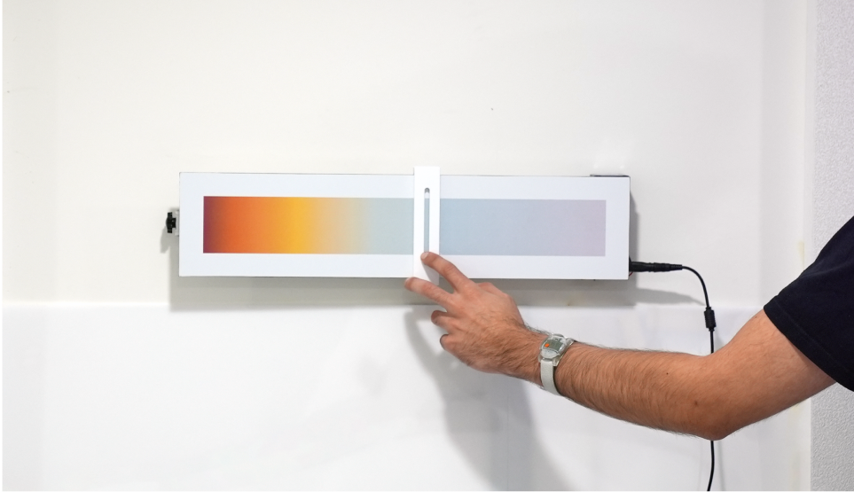

# human-centred-office-lighting
 
 This project pilots an ergonomic lighting system that mimics natural daylight, complementing the human environment, created for my 4th year Internet of Things elective module.

 This repository contains relevant code, tools and files to recereate the tests outline in the report, found under doc.
 
## Video

# CAD
Ive included relevant STEP files and parts lists in case you want to build the skylights detailed in the [report](doc/Human_centred_office_lighting.pdf)

## Skylights

The skylights can be made using only a laser cutter, and I've included the .dxf files for each sheet material in this repo. Adjust the power and speed according to you machine specs.

The enclosures are made from the following materials:
 - [144/m WS2812B RGB LED strip](https://www.amazon.co.uk/dp/B07Q9KCC6M?psc=1&ref=ppx_yo2ov_dt_b_product_details), these are unrbanded neopixels, and I was able to fit around 174 of them in each Skylight. That equated to around 4 Metres to make 3 Skylights. You'll have to cut these into two long strips of 75 LEDs and two short strips of 12 LEDs per light, and solder them back into a continuous loop.
 - [9mm birch plywood](https://www.techsoft.co.uk/products/laser-cutting-materials/laser-grade-plywood-birch), The inner volume of the skylight is created with 3 layers of this 9mm laser ply, connected with wood glue. The DXF file included splits each layer into 4 parts for better tesselation and material use. You could also route this part out of a thicker stock of MDF or plywood if you have access to a CNC.
 - [3mm White Acrylic](https://www.techsoft.co.uk/products/laser-cutting-materials/acrylic-coloured-clear), this amkes up the tob and bottom of the plywood sandwhich. The LED strips also get attached to the top piece of acrylic. Refer to the video to see how this is done.
 - [3mm Frosted Perspex](https://www.cutmy.co.uk/plastic/acrylic-perspex-sheets/frosted/), I reccomend getting a large stock of this and lasercutting.
 - [12mm standoffs](https://www.amazon.co.uk/dp/B0851MNP1F?psc=1&ref=ppx_yo2ov_dt_b_product_details) Any generic standoff will work, but the brushed steel ones used for mirrors help create a nice touch!

## Ambient interface

The ambient interface uses a variety of readily available 3D printer parts, a custom dibond panel and a few 3D printed sections. I've linked below UK based distributors, but you should be able to find these parts locally pretty easily.

Components:
 - [2040 V-Slot Aluminium Profile](https://printermods.co.uk/products/sku11014?variant=39904045334678) cut to 450mm
 - [3D printer Belt Tensioner](https://printermods.co.uk/products/sku12534?variant=43025082056950) you can probably get away with 3D printing one of these and adding a GT2 20T timing belt pulley yourself
 - [M4 T-Nuts](https://printermods.co.uk/products/sku11148?variant=36960296272022) used to attach everything to the 2040 profile, including wall mounts
 - [Pulley wheels w/ bearing](https://printermods.co.uk/products/sku10855?variant=36915990429846) Attached these to the printed gantry with M5 nuts / bolts
 - [GT2-6mm Timing Belt](https://printermods.co.uk/products/sku12225?variant=39977974562966)
 - [TMC2130 Stepper motor driver](https://printermods.co.uk/products/sku10554?variant=37188251451542) Feel free to substitute - this operates nice and silently on 12-24V
 - [Endstop limit switch](https://printermods.co.uk/products/sku11838?variant=37518415102102) CAD is dimensioned to fit this PCB, however it seems to be a common form factor of this switch
 - [Raspberry Pi Zero](https://shop.pimoroni.com/products/raspberry-pi-zero-2-w?variant=39493046075475) You'll need a microSD card, keyboard, mouse, monitor and 5V Micro USB power supply to program this. Pimoroni offer a lot of these accesories -  really good UK based supplier
 - [BH1745 Luminance and Colour Sensor](https://shop.pimoroni.com/products/bh1745-luminance-and-colour-sensor-breakout?variant=12767599755347) I used the pimoroni breakout version of this sensor (not the adafruit one), so CAD reflects this.
 - [NEMA17 Stepper Motor](https://shop.pimoroni.com/products/nema-stepper-motor?variant=31384801017939)
 - [120mm * 523mm custom printed white aluminium dibond](https://www.vcprint.co.uk/dibond-aluminium-signs.html) I used this print shop for the project, just send them an email asking for a custom size and indlude the GRADIENT.pdf file
 - [Large Command strips](https://www.screwfix.com/p/command-self-adhesive-strips-assorted-16-piece-set/109hp) Great for mounting both the interface and skylights. Check your local hardware store, they will mjost likely stock these
 - [Universal power adapter](https://www.amazon.co.uk/gp/product/B09TRL3XV9/ref=ox_sc_act_title_1?smid=A3QFP7NSA4Z43O&psc=1) You'll need these to power the lights and interface. I reccomend this variety as theyre adjustable and include multiple adapters, including the terminal connector used in this project

3D printed components:
 - [Wall_Mount.STL](cad/stl/Wall_Mount.stl), you'll need to of these. They attach to 2040 extrusion using T-Nuts, and then use command strips to stick to the wall
 - [Gantry_Front.STL](cad/stl/Gantry_Front.stl)
 - [Gantry_Back.STL](cad/stl/Gantry_Back.stl)
 - [Gantry_Clamp.STL](cad/stl/Gantry_Clamp.stl), this clamps the loose end of the timing belt to the gantry, and is secured to Gantry_back with two M3 bolts. I used threaded inserts but should work fine without
 - [Stepper_Mount.STL](cad/stl/Stepper_Mount.stl), houses the Pi, stepper, limit switch, motor driver and DC terminal connector. Attaches to the 2040 extrusion via T-Nuts. Stick to the bottom left of the Dibond back with expoxy or double sided-tape
 - [Other_Mount.STL](cad/stl/Other_Mount.stl), this sticks to the bottom right corner of the dibond, and secures the tensioner end of the 2040 extrusion. I reccomend sticking the Dibond to these mounts once everything else has been assembled onto the extrusion

You'll also need access to Jumper cables, M3, M4, M5 nuts and bolts as well as some general adhesive such as two part epoxy. Refer to the Step file to see how everything comes together, I've made sure everything is toleranced accurately so you can convert any part to STLs to print if you can't source them. 

# Prototyping

